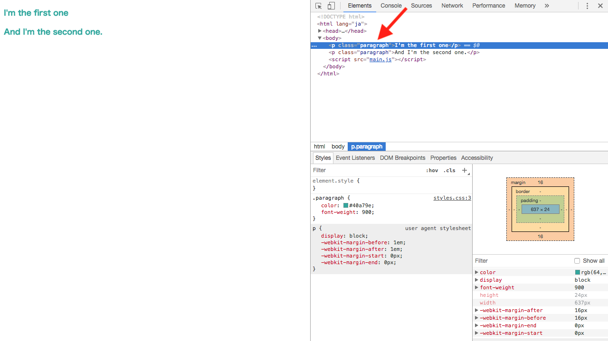

## DOMとは

DOMとは、Document Object Modelの略で、HTMLドキュメントの構造を書き、それを元にブラウザとのやり取りをして表示される反映をコントロールします。

## DOMツリー構造

DOMがどんなことをするものかわかったところで、DOMの構造がどんなものかを見ていきましょう。

DOMは、木構造、ツリーと呼ばれる構造を持っており、HTMLがそうであるように親、子、孫と関係性を見ることができます。
DOMによって書かれるHTMLでは親要素、子要素、孫要素と「要素」で認識されていますが、DOMのツリー構造では**_ノード_**がそれにあたります。
最上位のノード、つまり全てを包括しているノードのことを**_ルートノード_**呼び、それ以外のノードは全て親ノードを持ち、0個以上の子ノードを持っています。

DOMのルートノードは**_document_**で、子ノードは**_html_**です。
基本的には以下のツリーをDOMは持っています。

```js
/* DOMツリー構造 */
/*
document - head - title
                - meta
                - style
                - etc...

         - body - h1
                - div - h1 - テキスト
                　　　 - p - テキスト
                - etc...
*/
```

## DOM getメソッドとDOM要素に関するクエリ

HTML要素を簡単に素早く取得するために、DOMにはgetメソッドと言うものがいくつか用意されています。

| メソッド | 内容 |
| -------- | -------- |
| getElementById | 指定のID属性の要素を選択 |
| getElementsByClassName | 指定されたClass属性をもつ全ての集合体を取得 |
| getElementsByTagName | 指定されたタグをもつ全ての集合体を取得 |

そのほかには以下のクエリがあります。

| クエリ | 内容 |
| -------- | -------- |
| querySelector | 指定されたセレクタに合う文書中の最初の要素を返す |
| querySelectorAll | 指定されたセレクタに合う文書中の要素の全てのリストを返す |

DOMの要素を特定することがこれでできるようになりました。

## DOM要素を生成、操作する

さて、DOM要素を特定することができるようになったので、今度は特定したDOM要素を実際に操作してみたいと思います。
まずは特定されたノードを変更してみます。

それぞれの要素は`innerHTML`と`textContent`と言うプロパティを持っていて、この`innerHTML`や`textContent`プロパティを使うことでHTMLコードを用いてDOMノードを生成することができます。
DOMノードを生成することは`document.createElement`を使うことでも可能です。
少し気をつけるべきことは、`document.createElement`はDOMには付け加えないので、別のメソッドである`insertBefore`と`appendChild`で生成したDOMノードをDOMに付け加える必要があります。

## DOM APIを使った要素スタイルの制御

DOM APIを使用するとCSSスタイルの詳細までをコントロールできるようになります。
基本的にはCSSクラスを新たにCSSで定義して作成し、変更を加えたい要素に適用させます。

具体的に何ができるのか、簡単に例を見ていきましょう。

例えばpタグ全ての文字色を統一したい場合、`paragraph`というクラスをCSSで定義し、`paragraph`を付け加えます。

```css
.paragraph {
  color: #40a79e;
  font-weight: 900;
}
```

HTMLは以下のようになっています。

```html
<p>I'm the first one.</p>
<p>And I'm the second one.</p>
```

ここでJavaScriptを書いていきます。
全ての要素には上記のDOM生成と操作でも述べたプロパティ以外にも`classList`というプロパティがあり、各要素が持つクラスを知ることができます。

各要素が持つクラスを見つけただけでは何もできませんが、`classList`には`add`というメソッドがありクラスを加えることができるのです。

```js
function paragraphColor() {
  const paraColor = document.getElementsByTagName('p');
  for (let p of paraColor) {
    p.classList.add('paragraph'); // クラスを加える
  }
}

paragraphColor(); // 関数の呼び出し
```

少し先のレッスンで学ぶ内容が2つ出てきましたが、**function, 関数**と**for ... of ループ**は、簡単に説明するとそれぞれ**動詞、アクションの動きをするもの**と**特定要素に対して繰り返し処理を行うもの**です。
関数はレッスン9、**for ... of ループ**はレッスン7で詳しく学びます。

DOMを使用した要素のスタイル制御がどう動いているのかを見ていくために、少しだけここでの関数と**for ... ofループ**の役割も解説しながらDOM要素のスタイル制御の仕組みを見ていきます。

`function paragraphColor() { ... }`の「...」内で、実際に操作をしたいアクション、つまり要素のスタイルの操作内容を記述し、それを`paragraphColor();`と書いて呼び出します。
関数にもHTMLで言うClass属性のように名前をつけることができ、ここでは `paragraphColor`が関数名です。
HTMLでつけられたClass名は、CSSにセレクタとして呼び出すことができましたね。
関数でもそれと似たことをしているのです。
関数名をつけ、それを呼び出すことで特定の関数が動くという仕組みです。

今回は「pタグ全ての文字色を統一したい」というのが要素のスタイル制御内容になるので、上記getメソッドより、特定のタグを全て対象としてリストを返す`getElementsByTagName`で`paraColor`と言う変数でpタグを全て対象としてリストを返すように宣言します。

結果として、上記のHTML, CSS, JavaScriptでの出力は以下のようになり、上記の説明で想定したことがその通りに反映されているのが確認できます。



スタイルの制御で、「追加」をここまで行ってきましたが、追加ができるということはその逆の「削除」も存在します。

これも上記同様、使い方はほぼ同じで、クラスを加えていた`p.classList.add('paragraph');`を`p.classList.remove('paragraph');`にするだけです。
次の項目からスタイルを付けたりリセットしたりする機能を実装するので、スタイルをリセットする関数もここで書いておきます。

```js
// スタイル付け加え関数
function paragraphColor() {
  const paraColor = document.getElementsByTagName('p');
  for (let p of paraColor) {
    p.classList.add('paragraph'); // クラスを加える
  }
}

paragraphColor(); // 関数の呼び出し

// スタイルリセット関数
function paragraphReset() {
  const paraColor = document.getElementsByTagName('p');
  for (let p of paraColor) {
    p.classList.remove('paragraph'); // クラスをremoveする
  }
}

paragraphReset(); // 関数の呼び出し
```

## data属性

HTML5にあるdata属性を利用すると、それぞれの要素にJavaScriptで変化/変更する情報を追加することができるようになります。
試しにDOM APIを使ったスタイルの制御で使用した文字色とフォントの太さのスタイルを変化させるボタンを実装してみます。

先ほどのコードで、HTMLにボタンを追加します。

```html
<p>I'm the first one.</p>
<p>And I'm the second one.</p>

<button data-action="paragraph">
  文字色と太さが変わる
</button>
<button data-action="removeParagraphStyle">
  文字色と太さをリセット
</button>
```

data属性を呼ぶには、HTMLで`data-action`もしくは必要であれば`containing`も使用することで呼び出すことができます。
 `querySelectorAll`を使用して、`paragraph`を持つ要素を全て呼び出します。
 この時に少し気をつけたいのが、data属性の記述方法は今までのCSSセレクタとは異なるものなので、少しだけ異なります。

```js
const paragraphAction = document.querySelectorAll('[data-action="paragraph"]');
console.log(paragraphAction[0].dataset); // 出力結果：DOMStringMap {action: "paragraph"}
```
consoleでは、paragraphActionが対象になっている要素、つまり「文字色と太さが変わる」ボタンがdatasetとして呼び出されているかの確認です。

さて、これでdata属性は呼び出すことができましたが、機能的には仮のボタンがある状態で押したところでテキストの文字色とフォントの太さのスタイルが変わるという機能は備わっていません。
「機能」を追加することを、`イベント`の処理を追加するとJavaScriptでは言います。

イベントに関しては、次のレッスン5で詳しく学んでいき、上記のボタンの機能を実装していきます。

[サンプルコード](https://github.com/codegrit-jp-students/codegrit-js-unit01-lesson04-samples/tree/master/dom1)

## 更に学ぼう

### 動画で学ぶ

- [JavaScript入門 - ドットインストール](https://dotinstall.com/lessons/basic_javascript_v2)

### 本で学ぶ

- [Eloquent JavaScript 3rd Edition](http://eloquentjavascript.net/)
